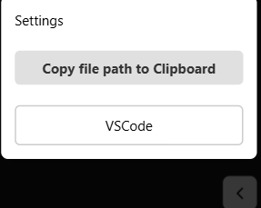

## 🖼 Screenshot



In this example, the `ReactClickInspector` component is imported and wrapped around the root of the application (e.g., in `App.tsx` or `main.tsx`). This ensures that all click events within the entire application are tracked.

You can also use the `ignoredPaths` prop to exclude specific paths or folders from being inspected. This is useful when you don’t want to log clicks within shared components or libraries.

### Example usage:

```tsx
import React from "react";
import ReactClickInspector from "react-click-inspector";
import App from "./App";

const Root = () => (
  <ReactClickInspector ignoredPaths={["fe-common", "common/myLibrary"]}>
    <App />
  </ReactClickInspector>
);

export default Root;
```
