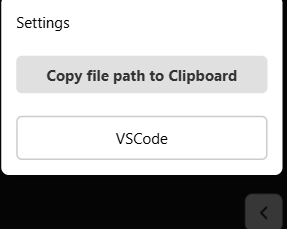

# react-click-inspector

A lightweight React developer tool: click any element in your running app and instantly copy the path of the component file that rendered it, or open that file at the exact line in **VS Code**.



## ✨ Features

- 📋 **Copy file path** of the clicked element's component to the clipboard
- 🧭 **Open in VS Code** at the exact file and line number
- 🙈 **Ignore paths** (shared components, libraries) so the inspector jumps to *your* code
- 🔒 **Localhost only**: the inspector is not rendered anywhere else, so it is safe to leave in your code
- 🎨 Customizable toggle button and settings panel

## 📦 Installation

```bash
npm install --save-dev react-click-inspector
```

or

```bash
yarn add -D react-click-inspector
```

## 🚀 Usage

Wrap the root of your application (e.g. in `main.tsx` or `App.tsx`) with `ReactClickInspector`:

```tsx
import React from "react";
import { ReactClickInspector } from "react-click-inspector";
import App from "./App";

const Root = () => (
  <ReactClickInspector ignoredPaths={["fe-common", "common/myLibrary"]}>
    <App />
  </ReactClickInspector>
);

export default Root;
```

A default export is also available:

```tsx
import ReactClickInspector from "react-click-inspector";
```

### How to use it in the browser

1. Click the toggle button in the bottom-right corner to open the **Settings** panel.
2. Choose a mode:
   - **Copy file path to Clipboard**: the next click copies the component's file path.
   - **VSCode**: the next click opens the component's file at the right line in VS Code.
3. Click any element in your app. The mode turns off automatically after one click.

Only one mode is active at a time. While a mode is active, the click is used by the inspector only: links, forms and your app's click handlers don't fire. Press **Escape** to cancel the active mode.

## ⚙️ Props

| Prop           | Type                  | Default     | Description                                                                                    |
| -------------- | --------------------- | ----------- | ---------------------------------------------------------------------------------------------- |
| `children`     | `ReactNode`           | (required)  | Your application.                                                                              |
| `enabled`      | `boolean`             | localhost   | Turns the inspector on or off. By default it is enabled only on `localhost`, `127.0.0.1` or `::1`. |
| `ignoredPaths` | `string \| string[]`  | `undefined` | File paths containing any of these strings are skipped, and the next parent component is used. |
| `icon`         | `ReactNode`           | arrow icon  | Custom content for the toggle button.                                                          |
| `toggleBtnCss` | `CSSProperties`       | `undefined` | Style overrides for the toggle button.                                                         |
| `modalCss`     | `CSSProperties`       | `undefined` | Style overrides for the settings panel.                                                        |

## 📋 Requirements

- **React 18** (`react` and `react-dom` `^18.0.0`).
- A **development build**. The inspector reads source locations from React's `_debugSource`, which is only present in development mode when JSX source info is enabled (Vite with `@vitejs/plugin-react`, Create React App and Next.js do this by default in dev).
- By default the app must run on **`localhost`**, `127.0.0.1` or `::1`; on any other host the inspector renders only `children`. Use the `enabled` prop to change this, e.g. `enabled={process.env.NODE_ENV === "development"}` for a LAN IP or custom dev domain.
- To open files from the browser, VS Code must be installed and registered as the handler for `vscode://` links (the default after installation).

> ⚠️ React 19 removed `_debugSource`, so it is not supported yet. When no source information is found, the inspector logs a warning in the console.
>
> ⚠️ Support for **WebStorm** and other IDEs is planned for upcoming versions.

## 🛠 Development

```bash
npm install
npm run typecheck
npm run lint
npm test
npm run build
```

## 📄 License

MIT © Nezer Abdullayev
